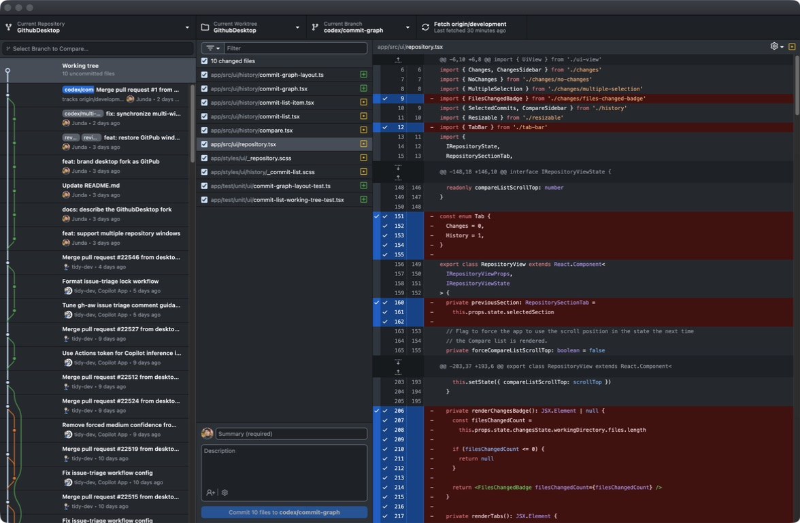

# GitPub: many repos, many windows

GitHub Desktop is good. Its one-window rule is not.

[Multi-window support has been requested since 2017](https://github.com/desktop/desktop/issues/3606).
More than 100 comments later, the team have not yet work on it.
Meanwhile, I have multiple projects running, agents working concurrently, and
exactly zero interest in playing repository musical chairs all day.

So I stopped waiting.

## What this fork fixes

- Open multiple repositories in independent windows.
- Work from one unified working tree and commit timeline.
- Add several local repositories at once by choosing their parent folder.

### 1. One project, one window

Open **File → New Window** or press `Cmd` + `Ctrl` + `N` on macOS (`Ctrl` +
`Alt` + `N` on Windows and Linux). Every window gets its own repository,
branch, history, and working state.

This is real multi-window support inside one app process. Shared background
work stays centralized, so opening 5 windows doesn't mean 5 copies of API
polling, notifications, updates, statistics, Git LFS setup, and repository
indicator refreshes hammering the network.

Repository lists and shared settings stay synchronized. Close the window that
owns the background work and another window takes over automatically.

The result is boring in the best possible way: one project per window, on the
desktop where it belongs.

### 2. One timeline. Zero tabs.

The Changes tab and History tab were never two different things. They were the
present and past of the same repository, split by a switch nobody needed.

GitPub removes the switch. The commit graph is now the default workspace, with
a selectable Working tree connected directly to HEAD.

Click Working tree and the right side becomes the full commit workflow: changed
files, line selection, diffs, commit message, stash and conflict tools, and the
Commit button. Click any commit and the same space shows its summary, files,
and diff.

Your current branch is impossible to miss. Other branches and merges draw
themselves as lines, so you can see where the work came from instead of
reconstructing it in your head.



No mode switch. No context reset. Just where the repository is now, and exactly
how it got there.

## Run it

This fork doesn't publish installers yet. Follow the upstream
[setup guide](./docs/contributing/setup.md), then build the real app bundle:

```sh
RELEASE_CHANNEL=test node vendor/yarn-1.21.1.js build:prod
open -n dist/GitPub-darwin-$(uname -m)/GitPub.app
```

`test` means no upstream auto-update channel. The app itself is compiled and
signed as a production build: no dev server, no hot reload, and no inspector
stapled to every window.

This is an unofficial fork. It isn't affiliated with or supported by GitHub,
Inc.

I needed windows. Now it has windows.

I wanted the whole repository in one view. Now it has that too.
